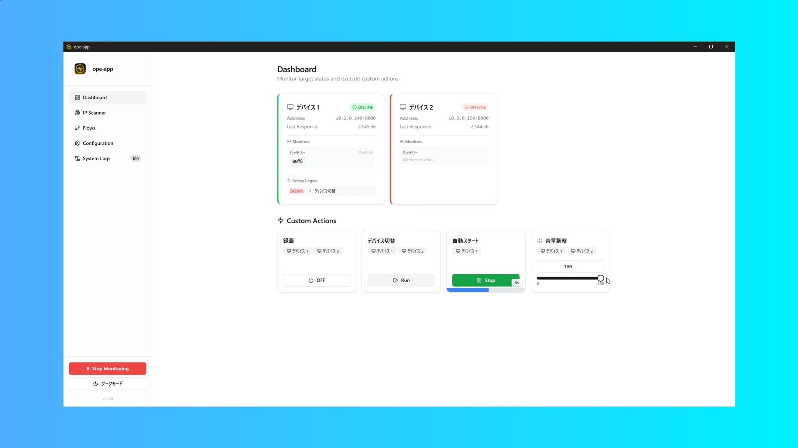
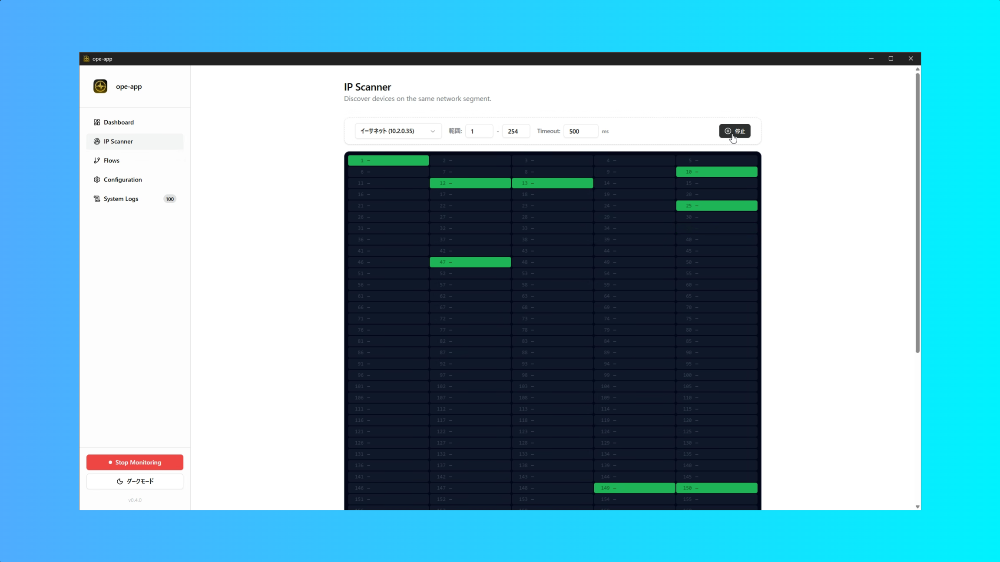
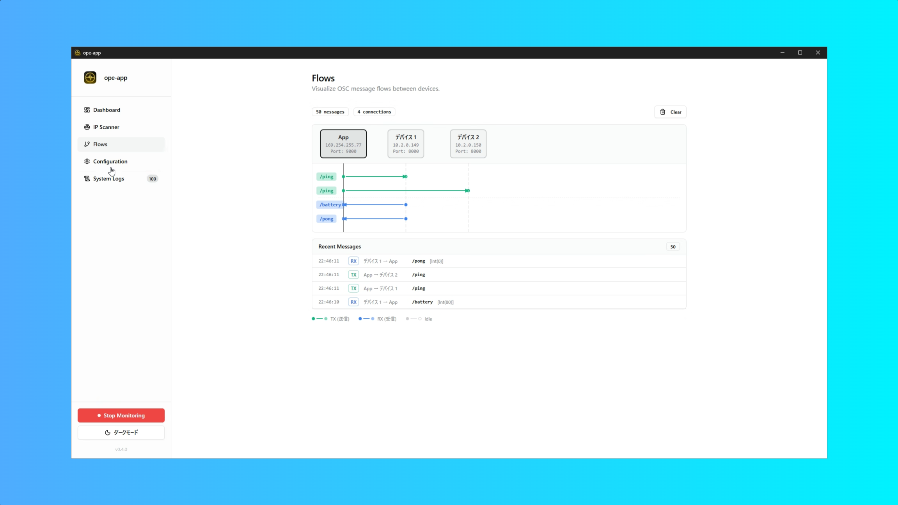
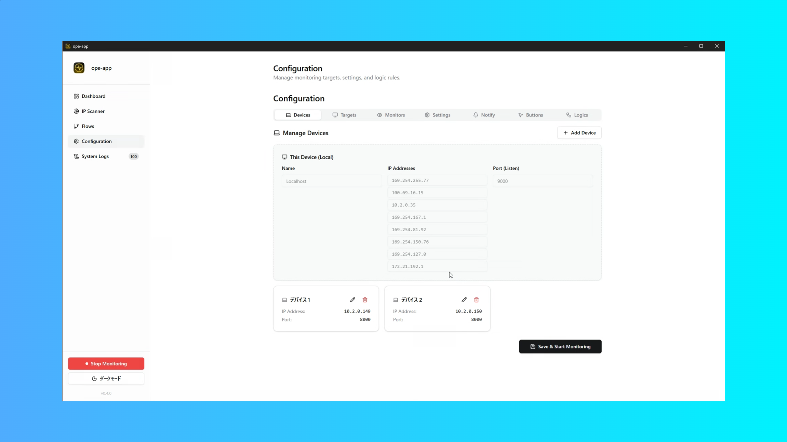

# ope-app

<p align="center">
  
</p>

OSC (Open Sound Control) を使用した統合監視・制御アプリケーションです。
ターゲットデバイスの死活監視、OSCメッセージによる制御、ネットワークスキャン、フロー可視化、Slackへの通知機能を備えています。

<p align="center">
  <video src="src/screenshots/howto." controls loop autoplay muted>
</p>

## 主な機能

### 🎯 ダッシュボード
- **死活監視**: 設定されたターゲットデバイスに対して定期的にPing (OSCメッセージ) を送信し、応答がない場合にOFFLINEと判定
- **カスタムボタン**: 任意のOSCメッセージを送信するボタンを作成可能
  - **Momentary**: ボタンを押した瞬間のみメッセージ送信
  - **Toggle**: ON/OFF切り替え式（ON/OFF時に異なるメッセージ送信可能）
  - **Periodic**: 指定した間隔で定期的にメッセージ送信
  - **Value**: スライダーで値を調整してメッセージ送信（Int/Float/String対応）
- **カスタムモニター**: ターゲットから送信されるOSCメッセージを監視・表示

### 🔍 IPスキャナー
- 同じネットワークセグメント上のデバイスを自動検出
- デバイス名、IPアドレス、MACアドレス、ベンダー情報を表示
- 検出したデバイスをワンクリックでデバイスリストに追加可能

### 📊 フロー可視化
- デバイス間のOSCメッセージフローをリアルタイムで視覚化
- メッセージの送受信状況を直感的に把握
- ノードベースのインタラクティブな表示

### ⚙️ 設定
- **デバイス管理**: 監視・制御対象のデバイスを登録
- **ターゲット選択**: 監視対象のデバイスを選択
- **監視設定**: 
  - Local Port: OSC受信ポート（デフォルト: 9000）
  - Interval: Ping送信間隔（ミリ秒）
  - Timeout: OFFLINE判定時間（ミリ秒）
  - Ping/Pong: 監視用OSCアドレスと引数のカスタマイズ
- **ロジック設定**: ターゲットのステータス変化（ONLINE/OFFLINE）をトリガーとして、自動的にカスタムボタンを実行
- **Slack通知**: Webhook URLと通知メッセージテンプレートを設定

### 📝 システムログ
- リアルタイムでシステムログとOSCメッセージを表示
- デバッグやトラブルシューティングに便利

### 🎨 UI/UX
- **ライト/ダークモード**: テーマの切り替えに対応
- **モダンなUI**: React + Shadcn/ui + Tailwind CSS による洗練されたインターフェース
- **レスポンシブデザイン**: 画面サイズに応じて最適化

## スクリーンショット

### ダッシュボード

*ターゲットデバイスのステータス監視とカスタムボタン操作*

### IPスキャナー

*ネットワーク上のデバイスを自動検出*

### フロー可視化

*OSCメッセージフローの可視化*

### 設定画面

*デバイス、ターゲット、ボタン、ロジック、各種設定の管理*

## インストールと起動

### 必要要件
- Node.js (v20以上推奨)
- Rust (最新の安定版)
  ```bash
  curl --proto '=https' --tlsv1.2 -sSf https://sh.rustup.rs | sh
  ```

### セットアップ手順

1.  **リポジトリのクローン**:
    ```bash
    git clone <repository-url>
    cd ope-app
    ```

2.  **依存関係のインストール**:
    ```bash
    npm install
    ```

3.  **開発モードで起動**:
    ```bash
    npm run tauri dev
    ```

4.  **本番ビルド**:
    ```bash
    npm run tauri build
    ```
    ビルドされたアプリケーションは `src-tauri/target/release/bundle` 配下に生成されます。
    - macOS: `src-tauri/target/release/bundle/dmg/ope-app_*.dmg`
    - Windows: `src-tauri/target/release/bundle/msi/ope-app_*.msi`
    - Linux: `src-tauri/target/release/bundle/deb/ope-app_*.deb`

## 使い方

### 基本的なワークフロー

#### 1. デバイスの登録
1. サイドバーから「Configuration」を選択
2. 「Devices」タブで「Add Device」をクリック
3. デバイス名、IPアドレス、ポート番号を入力
4. 「Save」で保存

**ヒント**: IPスキャナーを使用すると、ネットワーク上のデバイスを自動検出して簡単に登録できます。

#### 2. 監視ターゲットの設定
1. 「Targets」タブで、監視したいデバイスにチェックを入れる
2. チェックを入れたデバイスのみが死活監視の対象になります
3. 設定を保存

#### 3. 監視設定のカスタマイズ
「Settings」タブで以下の設定を調整できます：

- **Local Port**: このアプリがOSCメッセージを受信するポート（デフォルト: 9000）
- **Ping Interval**: 監視対象への死活確認の間隔（ミリ秒）
- **Timeout**: 応答がない場合にOFFLINEと判定する時間（ミリ秒）
- **Ping Address/Args**: 死活確認に使用するOSCアドレスと引数
- **Pong Address/Args**: 応答として期待するOSCアドレスと引数
- **Slack Webhook URL**: Slack通知用のWebhook URL
- **Notification Template**: 通知メッセージのテンプレート（`{deviceName}`, `{status}`, `{timestamp}` が使用可能）

#### 4. カスタムボタンの作成
「Buttons」タブでOSC送信用のボタンを作成：

1. 「Add Button」をクリック
2. ボタン名とモードを選択：
   - **Momentary**: ボタンを押している間のみ送信
   - **Toggle**: ON/OFFを切り替え（それぞれ異なるメッセージ送信可能）
   - **Periodic**: 指定した間隔で定期的に送信
   - **Value**: スライダーで値を調整（Int/Float/String対応）
3. 送信先デバイスを選択（複数選択可能）
4. OSCアドレスと引数を設定
5. 保存

#### 5. ロジック（自動化）の設定
「Logics」タブで、ステータス変化に応じた自動実行ルールを設定：

1. 「Add Logic」をクリック
2. トリガーとなるデバイスとステータス（ONLINE/OFFLINE）を選択
3. 実行するカスタムボタンを選択
4. 保存

**使用例**:
- メインPCがOFFLINEになったら、バックアップPCに切り替えコマンドを送信
- 特定の機器がONLINEになったら、初期化シーケンスを実行

#### 6. カスタムモニターの設定
「Custom Monitors」タブで、特定のOSCメッセージを監視：

1. 「Add Monitor」をクリック
2. モニター名とOSCアドレスを設定
3. 引数の定義を追加（名前と型を指定）
4. 保存

ダッシュボードで、受信した値がリアルタイムで表示されます。

#### 7. 監視の開始
1. サイドバー下部の「Start Monitoring」ボタンをクリック
2. ダッシュボードで各ターゲットのステータスを確認
3. カスタムボタンでOSCメッセージを送信

### 便利な機能

#### IPスキャナー
1. サイドバーから「IP Scanner」を選択
2. 「Start Scan」をクリック
3. 検出されたデバイスの「Add to Devices」をクリックして、デバイスリストに追加

#### フロー可視化
1. サイドバーから「Flows」を選択
2. デバイス間のOSCメッセージフローが視覚的に表示されます
3. ノードをドラッグして配置を調整可能

#### システムログ
1. サイドバーから「System Logs」を選択
2. OSCメッセージの送受信やシステムイベントをリアルタイムで確認
3. 「Clear Logs」でログをクリア

#### テーマの切り替え
- サイドバー下部の「ダークモード」/「ライトモード」ボタンでテーマを切り替え

## 技術スタック

### フロントエンド
- **Framework**: React 18 + TypeScript
- **Build Tool**: Vite 7
- **UI Library**: Shadcn/ui (Radix UI ベース)
- **Styling**: Tailwind CSS
- **State Management**: React Hooks
- **Flow Visualization**: React Flow

### バックエンド
- **Framework**: Tauri 2.x
- **Language**: Rust
- **OSC Library**: rosc (Open Sound Control)
- **HTTP Client**: reqwest (Slack通知用)
- **Network Scanning**: ARP-based device discovery
- **Serialization**: serde + serde_json

### その他
- **Cross-platform**: macOS, Windows, Linux対応
- **IPC**: Tauri Command System
- **Event System**: Tauri Event System
- **Storage**: ファイルベース設定保存

## アーキテクチャ

```
┌─────────────────────────────────────────┐
│         Frontend (React + TS)            │
│  ┌────────────┬────────────┬──────────┐ │
│  │ Dashboard  │ IP Scanner │  Flows   │ │
│  └────────────┴────────────┴──────────┘ │
│  ┌───────────────────────────────────┐  │
│  │      Configuration Manager        │  │
│  └───────────────────────────────────┘  │
└──────────────┬──────────────────────────┘
               │ Tauri IPC
┌──────────────┴──────────────────────────┐
│         Backend (Rust + Tauri)          │
│  ┌────────────┬────────────┬──────────┐ │
│  │   Monitor  │ OSC Service│ Network  │ │
│  │   Service  │            │ Scanner  │ │
│  └────────────┴────────────┴──────────┘ │
│  ┌───────────────────────────────────┐  │
│  │      Config & State Manager       │  │
│  └───────────────────────────────────┘  │
└──────────────┬──────────────────────────┘
               │ OSC Protocol
┌──────────────┴──────────────────────────┐
│       External OSC Devices              │
│   (Monitored Targets & Controllers)     │
└─────────────────────────────────────────┘
```

## トラブルシューティング

### ポートが使用中のエラー
```
Failed to bind OSC listener to port 9000: Address already in use
```
**解決方法**:
1. 設定で別のポート番号を指定
2. または、ポート9000を使用しているプロセスを終了

### デバイスが検出されない
**確認事項**:
- ターゲットデバイスとアプリが同じネットワークセグメントにいるか
- ターゲットデバイスのファイアウォール設定
- ターゲットデバイスがOSCメッセージを受信できるか

### 監視が動作しない
**確認事項**:
1. 「Start Monitoring」ボタンが押されているか
2. ターゲットが正しく選択されているか
3. Ping/Pongの設定がターゲットデバイスと一致しているか
4. System Logsでエラーメッセージを確認

## 開発

### プロジェクト構造
```
ope-app/
├── src/                    # フロントエンドソース
│   ├── components/        # Reactコンポーネント
│   │   ├── Dashboard.tsx
│   │   ├── ConfigForm.tsx
│   │   ├── NetworkScanner.tsx
│   │   ├── FlowViewer.tsx
│   │   └── ui/           # UIコンポーネント (Shadcn)
│   ├── types.ts          # 型定義
│   └── App.tsx           # メインアプリケーション
├── src-tauri/             # バックエンドソース
│   ├── src/
│   │   ├── main.rs       # エントリーポイント
│   │   ├── monitor.rs    # 死活監視ロジック
│   │   ├── osc_service.rs # OSC送受信
│   │   ├── network_scanner.rs # ネットワークスキャン
│   │   └── models.rs     # データモデル
│   └── tauri.conf.json   # Tauri設定
└── README.md
```

### 貢献
プルリクエストを歓迎します！バグ報告や機能リクエストは、GitHubのIssuesでお願いします。

## ライセンス

MIT License - 詳細は [LICENSE](LICENSE) ファイルを参照してください。

## 作者

開発: [@kyoheiogawa](https://github.com/kyoheiogawa)
